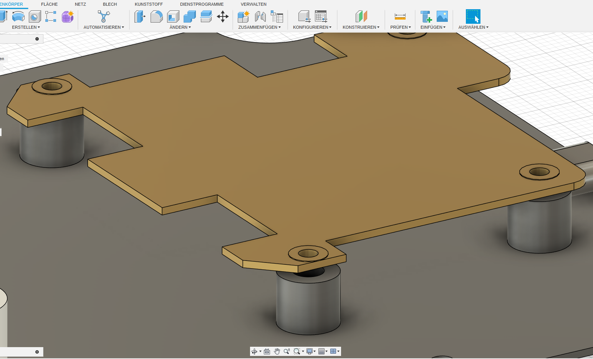
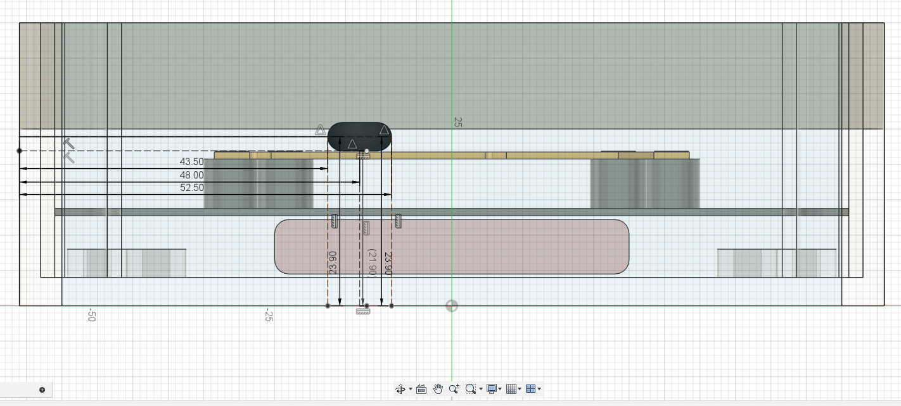

# Case Design and Model

## Box4u Case Details

### Base

The Basement of the Case has the following specifications : 
  -  rounded corners (radius R6)
  -  outer dimensions of approximately 120/119.3 mm (width) and 114/113.3 mm (height) 
  -  a width (main rectangle) of 120/119.3 mm (with a tolerance of +/- 0.35 mm) and a height of 114/113.3 mm 
  -  a inner width (main section) of 97.2/96.5 mm, a inner height of 98 mm and depth of 4/6.5 mm 
  -  cutouts of ø3 and ø8.5 mm
  -  

### Lid

The Lid of the Case has the following specification: 
  - edges of approximately 120 mm 
  - length  of (120/119.5 mm) 
  - about 4-5 mm wide (the difference between the outer and inner dimensions)

### Depth

The Side View reveals follwoing specifications:
  - a total width of 15 mm and an  additional 3 mm on each side
  - a height of 48 mm and a depth of 40 mm
  - a total length of 2 × 7 mm + 4 mm = 18 mm. 
  - a total height of 55 mm
  - a width of approximately 21 mm
  - a depth of 40 mm
  - a maximum installation height of 48 mm 
  - a total height of 55 mm. 

### Screw Detail

Cylinder Screws (M4 x 24 / 10 (DIN EN ISO 7045/))

<! Board Sketch-->

<! Steps 1-->

<! Steps 2-->

<! Steps 3-->

<! Steps 4-->

<! Steps 5-->

