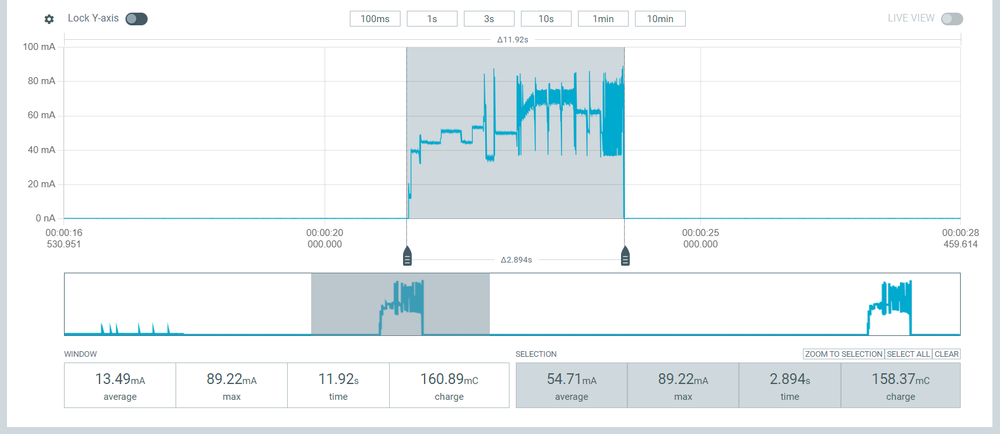
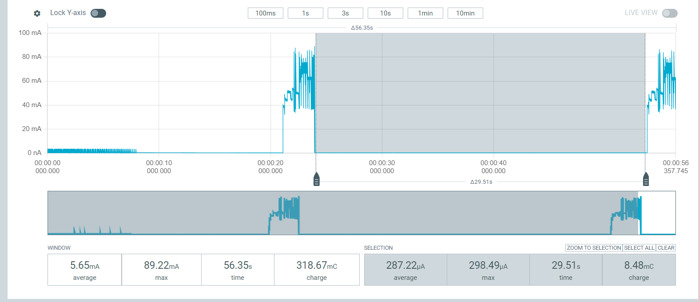
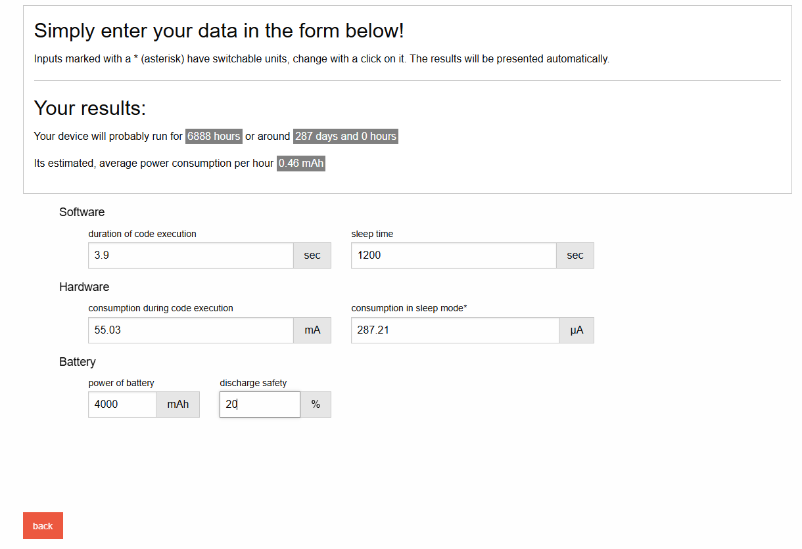
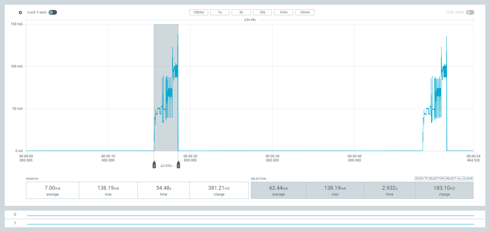
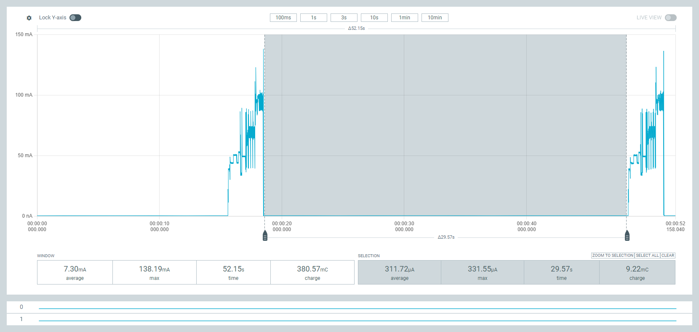
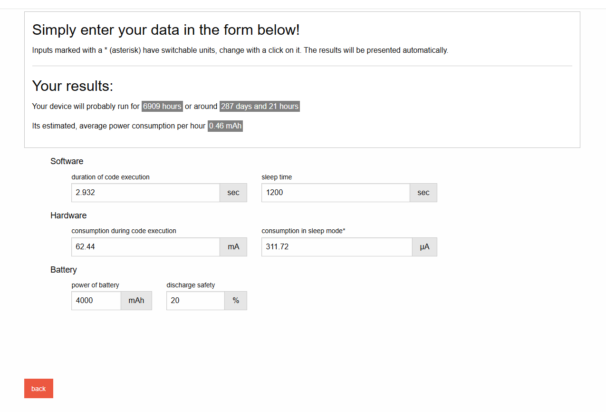

# Data Logger

## Description

This project simplifies data logging to external storage (SD card / EEPROM).

## Content

- [Hardware](#hardware)
- [Documentation](#documentation)
- [Data Types](#data-types)
- [EEPROM Data Storage Simulation](#eeprom-data-storage-simulation)
- [Data Storage Management](#data-storage-management)
- [Power Consumption Simulation](#power-consumption-simulation)
- [Power Consumption Simulation with Liquid Level Sensor](#power-consumption-simulation-with-liquid-level-sensor)
- [Modification: Addition of Liquid Sensor](#modified-data-logger--addition-of-the-liquid-level-sensor)

## Hardware

### RawWireless WisBlock

| Component  | Price (€) | Description                                  |
|------------|-----------|----------------------------------------------|
| RAK11200   | 13.16     | ESP32-based module with WiFi & BLE           |
| RAK11310   | 17.01     | Raspberry Pi-based module with LoRa transceiver |
| RAK19002   | 06.65     | Power slot module (Li-Ion, USB-C, Solar)     |
| RAK15000   | 15.96     | EEPROM module                               |
| RAK15002   | 04.90     | SD card module                              |
| RAK12002   | 09.50     | RTC Module                                  |
| RAK19011   | 20.90     | Development Board                           |
| RAK19012   | 06.90     | Development Board                           |
| RAK5802    | 07.97     | Interface                                   |
| RAK1906    | 20.21     | Environmental sensor module                 |
| RS485      | 06.00     | Liquid level sensor + connector             |
| **Total**  | **129.16** |                                           |

## Documentation

For datasheets, quick guides, and detailed descriptions, visit:  
[docs.RawWireless.com](https://docs.RawWireless.com)

## Software

- **IDE:** Arduino IDE  
- **Project files:** Included in the project folder  

## Data Types

### 1. Timestamp  
### 2. Environmental Sensor:
   - Temperature
   - Pressure
   - Humidity
   - Gas
### 3. Liquid Level Sensor:
   - Liquid Level
   - Water Pressure

## EEPROM Data Storage Simulation

### Properties

- **Endurance:** 1 million write cycles
- **Size:** 2Mb (2,097,152 bits), organized as 262,144 words (8-bit format)
- **Power:** Standby current ~3 µA  
- **Write Mode:** 256-byte page writes (reduces wear)
- **Voltage:** 3.3V (can be controlled via the core)

### Restrictions

- **Capacity:** 2MB
- **Estimated endurance:** 2-3 months

### Storage Calculation

#### Option 1 (Without Optimization)

- 1 × 32-bit Unix timestamp
- 1 × 32-bit temperature
- 1 × 32-bit pressure
- 1 × 32-bit humidity
- 1 × 32-bit gas level
- 1 × 32-bit liquid level / water pressure
- 1 × 32-bit voltage level  
**Total:** 224 bits  

**Iterations:**  
`(2^20 * 2) / 224 = 9,362`

#### Option 2 (Optimized Storage)

- 1 × 32-bit Unix timestamp
- 1 × 16-bit temperature (-40°C to 85°C)
- 1 × 32-bit pressure
- 1 × 16-bit humidity (0% to 100%)
- 1 × 32-bit gas level
- 1 × 32-bit liquid level / water pressure (0 mm to 5000 mm)
- 1 × 16-bit voltage level (0V to 24V)  
**Total:** 144 bits  

**Iterations:**  
`(2^20 * 2) / 144 = 14,564`

**Difference:** +5,201 iterations with optimization.

### EEPROM RAK15000

- **Size:** 2Mb (2 × 2^20 = 2,097,152 bits)  
- **Storage:** Linear, sequential  
- **Address range:** 262,144 addresses (1 byte per address)

### EEPROM RAK11200 (Internal)

- **Size:** 64Kb (524,288 bits)  
- **Storage:** Linear, sequential  
- **Address range:** 16-bit (0x0000 to 0xFFFF)  
- **Note:** May contain pre-configured LoRaWAN data.

## **Metadata and Storage Layout**

EEPROM data storage is structured to ensure efficient tracking and retrieval. 
The first **8 bytes (64 bits)** are reserved for metadata:

1. **Write Counter** (20-bit) → Tracks total write cycles  
2. **Storage Position Counter** (18-bit) → Tracks the next writable address
3. **Empty Bits** (26 Bits) -> For Future Usage

**Total Metadata Size:** 64 bits

- **Write Counter:** 20 bits (supports up to 1,000,000 cycles = `0xF4240`)  
- **Storage Position Counter:** 18 bits (supports up to 262,144 addresses)  
- **Total Reserved Space:** 8 bytes

## EEPROM Data Reader / Decoder

### **Reading Process**
EEPROM contains two main sections:  
1. **Metadata:** First **8 bytes** (Indexes 0-7) store counters and tracking information.  
2. **Sensor Data Blocks:** Data is stored in **sets of 32 bytes**, following a specific sequence:
   - Temperature  
   - Pressure  
   - Humidity  
   - Gas resistance  
   - RTC timestamp

## Data Erasure Before Switching Context/Sensors

### Steps to Erase Data:

1. **Collected Data Backup:** Before erasing, ensure any necessary data is backed up.
2. **Overwrite:** With standart Value of 0x00.
3. **Metadata Reset:** is done automatically by step 2 (Overwrite).
4. **Metadata Configuration:** Setting the Address Counter to Byte 8 (0-7 Metadata).
5. **Date and Time Configuration:** Setting the Date and Time of the RTC. 

## Power Consumption Simulation

### Normal Mode

**Results:**

Average power consumption during deep sleep was 54.71 mA over a duration of 2.894 seconds. The battery life calculation considered the following parameters:

- Code execution duration: 3.9 seconds
- Sleep time: 1200 seconds
- Consumption during code execution: 55.03 mA
- Consumption in sleep mode: 54.71 mA
- Battery capacity: 2500 mAh with 20% discharge safety margin.

### DeepSleep Mode

**Results:**

Average power consumption during deep sleep was 287.22 µA over a duration of 29.51 seconds. The battery life calculation considered the following parameters:

- Code execution duration: 3.9 seconds
- Sleep time: 1200 seconds
- Consumption during code execution: 55.03 mA
- Consumption in deep sleep mode: 287.21 µA
- Battery capacity: 2500 mAh with 20% discharge safety margin.

Estimated battery life: approximately 4305 hours, equivalent to around 179 days and 9 hours. Estimated average power consumption per hour: 0.46 mAh.

## Power Consumption Simulation with Liquid Level Sensor

### Normal Mode

**Results:**

Average power consumption during deep sleep was 54.71 mA over a duration of 2.894 seconds. The battery life calculation considered the following parameters:

- Code execution duration: 3.9 seconds
- Sleep time: 1200 seconds
- Consumption during code execution: 55.03 mA
- Consumption in sleep mode: 54.71 mA
- Battery capacity: 2500 mAh with 20% discharge safety margin.

### DeepSleep Mode

**Results:**

Average power consumption during deep sleep was 287.22 µA over a duration of 29.51 seconds. The battery life calculation considered the following parameters:

- Code execution duration: 3.9 seconds
- Sleep time: 1200 seconds
- Consumption during code execution: 55.03 mA
- Consumption in deep sleep mode: 287.21 µA
- Battery capacity: 2500 mAh with 20% discharge safety margin.

Estimated battery life: approximately 4305 hours, equivalent to around 179 days and 9 hours. Estimated average power consumption per hour: 0.46 mAh.

## Modified Data Logger / Addition of the Liquid Level Sensor

### RS485 Liquid Level Sensor

#### Overview
The **RS485 Liquid Level Sensor** is a high-precision sensor designed for measuring liquid levels. 

#### Features
**Anti-corrosion material** – Durable and resistant  
**Modbus-RTU communication** – Compatible with PLCs, displays, and data loggers  
**High-precision sensor** – ±0.25% accuracy  
**Wide operating voltage** – 11–30V DC  
**Fast response time** – ≤ 5 ms  

### Technical Specifications

| Parameter                   | Value                          |
|-----------------------------|--------------------------------|
| **Measurement Range**       | 0 ~ 5 meters                   |
| **Output**                  | RS485 (Modbus-RTU)             |
| **Accuracy**                | ±0.25% F.S.                    |
| **Temperature Range**       | -40°C to +85°C                 |
| **Material**                | 304/316L Stainless Steel       |
| **Power Supply**            | 11–30V DC                      |
| **Weight**                  | 670 g                          |

#### Wiring
The sensor is connected via an **Aviation Connector** interface. The pin configuration is:

| Pin | Description        |
|-----|-------------------|
| 12V (RAK5801)   | 12V Power Supply (VCC Sensor)  |
| A1  (RAK5801)   | GND (GND Sensor)               |

#### Modbus-RTU Communication
#### Default Communication Settings:
- **Baud Rate**: 9600 bps (supports 1200–115200 bps)
  **Note:** Changes to baud rate and slave address take effect immediately. If not, restart the sensor.

### RAK5801 Sensor Module

#### Overview
The **RAK5801** is a high-performance sensor module designed for industrial and environmental monitoring applications. 
Part of the WisBlock ecosystem, it offers robust data acquisition and is engineered for reliable performance even in harsh conditions.

#### Features
- **High-Precision Measurement** – accurate data collection.
- **Rugged Design** –  reliably in industrial environments.
- **Seamless Integration** – Easily integrates.
- **Versatile Interfaces** – Supports standard communication protocols.

### RAK19002 Sensor Module

#### Overview
The **RAK19002** is a sensor module developed for versatile IoT applications within the WisBlock ecosystem.
It is designed to provide reliable, accurate measurements for various environmental and application-specific parameters.

#### Features
- **Compact & Low Power** – Optimized for energy-efficiency.
- **High Accuracy** – Ensures precise measurement data.
- **Plug-and-Play Integration** – interfaces with WisBlock.
- **Robust Performance** – Suitable for operating conditions.

