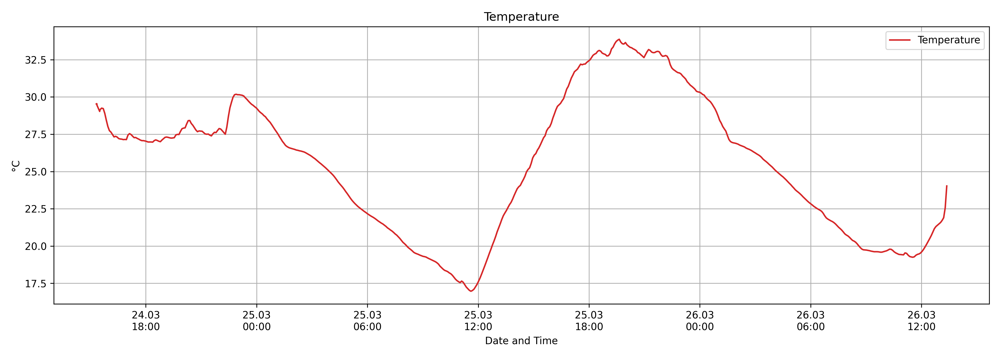
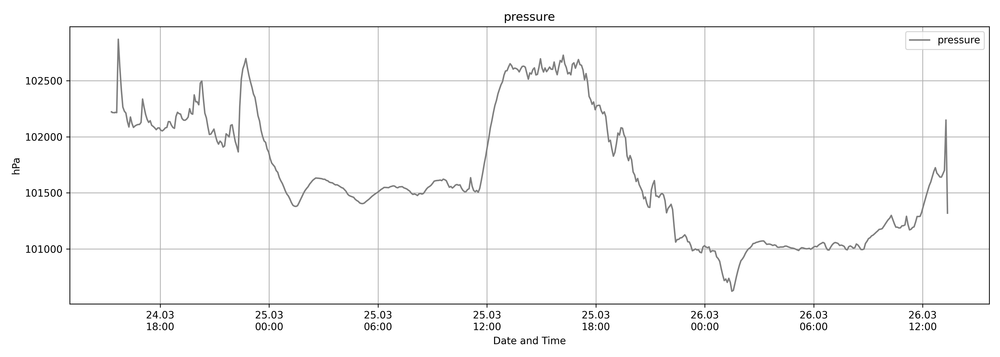
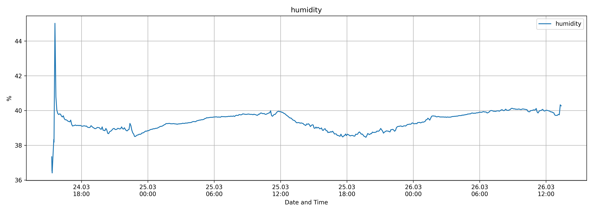
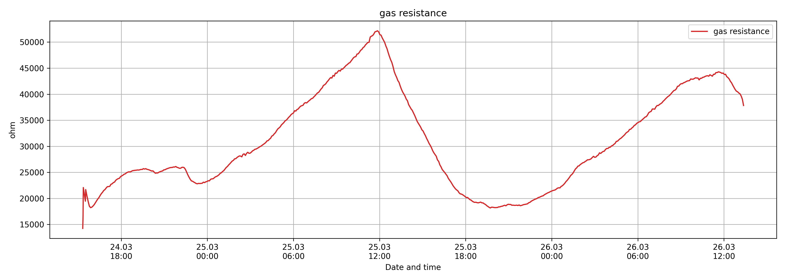

# Data Logger

## Description

This project simplifies data logging to external storage (SD card / EEPROM).

## Content

- [Hardware](#hardware)
- [Documentation](#documentation)
- [Data Types](#data-types)
- [EEPROM Data Storage Simulation](#eeprom-data-storage-simulation)
- [Data Storage Management](#data-storage-management)
- [Power Consumption Simulation](#power-consumption-simulation)

## Hardware

### RawWireless WisBlock

| Component  | Price (€) | Description                                  |
|------------|-----------|----------------------------------------------|
| RAK11200   | 13.16     | ESP32-based module with WiFi & BLE           |
| RAK11310   | 17.01     | Raspberry Pi-based module with LoRa transceiver |
| RAK19002   | 06.65     | Power slot module (Li-Ion, USB-C, Solar)     |
| RAK15000   | 15.96     | EEPROM module                               |
| RAK15002   | 04.90     | SD card module                              |
| RAK12002   | 09.50     | RTC Module                                  |
| RAK19011   | 20.90     | Development Board                           |
| RAK19012   | 06.90     | Development Board                           |
| RAK5802    | 07.97     | Interface                                   |
| RAK1906    | 20.21     | Environmental sensor module                 |
| RS485      | 06.00     | Liquid level sensor + connector             |
| **Total**  | **129.16** |                                           |

## Documentation

For datasheets, quick guides, and detailed descriptions, visit:  
[docs.RawWireless.com](https://docs.RawWireless.com)

## Software

- **IDE:** Arduino IDE  
- **Project files:** Included in the project folder  

## Data Types

### 1. Timestamp  
### 2. Environmental Sensor:
   - Temperature
   - Pressure
   - Humidity
   - Gas
### 3. Liquid Level Sensor:
   - Liquid Level
   - Water Pressure

## EEPROM Data Storage Simulation

### Properties

- **Endurance:** 1 million write cycles
- **Size:** 2Mb (2,097,152 bits), organized as 262,144 words (8-bit format)
- **Power:** Standby current ~3 µA  
- **Write Mode:** 256-byte page writes (reduces wear)
- **Voltage:** 3.3V (can be controlled via the core)

### Restrictions

- **Capacity:** 2MB
- **Estimated endurance:** 2-3 months

### Storage Calculation

#### Option 1 (Without Optimization)

- 1 × 32-bit Unix timestamp
- 1 × 32-bit temperature
- 1 × 32-bit pressure
- 1 × 32-bit humidity
- 1 × 32-bit gas level
- 1 × 32-bit liquid level / water pressure
- 1 × 32-bit voltage level  
**Total:** 224 bits  

**Iterations:**  
`(2^20 * 2) / 224 = 9,362`

#### Option 2 (Optimized Storage)

- 1 × 32-bit Unix timestamp
- 1 × 16-bit temperature (-40°C to 85°C)
- 1 × 32-bit pressure
- 1 × 16-bit humidity (0% to 100%)
- 1 × 32-bit gas level
- 1 × 32-bit liquid level / water pressure (0 mm to 5000 mm)
- 1 × 16-bit voltage level (0V to 24V)  
**Total:** 144 bits  

**Iterations:**  
`(2^20 * 2) / 144 = 14,564`

**Difference:** +5,201 iterations with optimization.

### EEPROM RAK15000

- **Size:** 2Mb (2 × 2^20 = 2,097,152 bits)  
- **Storage:** Linear, sequential  
- **Address range:** 262,144 addresses (1 byte per address)

### EEPROM RAK11200 (Internal)

- **Size:** 64Kb (524,288 bits)  
- **Storage:** Linear, sequential  
- **Address range:** 16-bit (0x0000 to 0xFFFF)  
- **Note:** May contain pre-configured LoRaWAN data.

## **Metadata and Storage Layout**

EEPROM data storage is structured to ensure efficient tracking and retrieval. 
The first **8 bytes (64 bits)** are reserved for metadata:

1. **Write Counter** (20-bit) → Tracks total write cycles  
2. **Storage Position Counter** (18-bit) → Tracks the next writable address
3. **Empty Bits** (26 Bits) -> For Future Usage

**Total Metadata Size:** 64 bits

- **Write Counter:** 20 bits (supports up to 1,000,000 cycles = `0xF4240`)  
- **Storage Position Counter:** 18 bits (supports up to 262,144 addresses)  
- **Total Reserved Space:** 8 bytes

## EEPROM Data Reader / Decoder

### **Reading Process**
EEPROM contains two main sections:  
1. **Metadata:** First **8 bytes** (Indexes 0-7) store counters and tracking information.  
2. **Sensor Data Blocks:** Data is stored in **sets of 32 bytes**, following a specific sequence:
   - Temperature  
   - Pressure  
   - Humidity  
   - Gas resistance  
   - RTC timestamp

## Data Erasure Before Switching Context/Sensors

### Steps to Erase Data:

1. **Collected Data Backup:** Before erasing, ensure any necessary data is backed up.
2. **Overwrite:** With standart Value of 0x00.
3. **Metadata Reset:** is done automatically by step 2 (Overwrite).
4. **Metadata Configuration:** Setting the Address Counter to Byte 8 (0-7 Metadata).
5. **Date and Time Configuration:** Setting the Date and Time of the RTC. 

## Power Consumption Simulation

### Normal Mode

**Results:**

Average power consumption during deep sleep was 54.71 mA over a duration of 2.894 seconds. The battery life calculation considered the following parameters:

- Code execution duration: 3.9 seconds
- Sleep time: 1200 seconds
- Consumption during code execution: 55.03 mA
- Consumption in sleep mode: 54.71 mA
- Battery capacity: 2500 mAh with 20% discharge safety margin.

### DeepSleep Mode

**Results:**

Average power consumption during deep sleep was 287.22 µA over a duration of 29.51 seconds. The battery life calculation considered the following parameters:

- Code execution duration: 3.9 seconds
- Sleep time: 1200 seconds
- Consumption during code execution: 55.03 mA
- Consumption in deep sleep mode: 287.21 µA
- Battery capacity: 2500 mAh with 20% discharge safety margin.

Estimated battery life: approximately 4305 hours, equivalent to around 179 days and 9 hours. Estimated average power consumption per hour: 0.46 mAh.

## Data Logger Results

The approach was tested in a lab environment near a ventilation system to demonstrate variance in sensing
values. The data doesn’t align with the weather data because the carry out of the test were made in indoor
conditions equipped with a cooling system. The measurements were executed accurately without outliers,
extreme values, or missing data on both storage devices. The test results were reliable and fulfilled the
requirements. The data was stored in the predefined format and correct sequence. No issues were faced
during the decoding phase. The collected data was in a CSV format and could be analyzed by using a
third party tool. In this project, the analysis phase was implemented with Jupyter Notebook. 
**A general overview is provided below:**

### Temperature

The image shows a line graph which describes the temperature over a period of approximately 60 hours.
The x-axis represents the date and time, starting at 6:00 PM on March 24 and ending at 12:00 PM on
March 26. The y-axis shows the temperature in degrees Celsius (°C), ranging from approximately 17.5°C 
to over 33 °C. A significant increase in temperature from March 24 to the afternoon of March 25,
followed by a decrease until the morning of March 26. On March 26, the temperature rises again at the
end. The curve shows a typical daytime and night-time temperature trend with variance.

### Pressure

The x-axis shows the date and time, starting on March 24 at 6:00 PM and ending on March 26 at
12:00 PM. The y-axis shows air pressure in hPa, with values between approximately 100.800 and 102.700hPa. 
There are intervals of a strong positive and negative variance. At the beginning of the graph,
the air pressure shows a high value of approximately 102.200 hPa, before raising and then falling again af-
ter a short time. An increase is observed, peaking at 102.600 hPa, before the pressure decreases again. 
At the end, another increase in air pressure can be seen.

### Humidity

The horizontal axis shows the date and time from 6:00 PM on March 24th to 12:00 PM on March 26th.
The vertical axis shows the humidity in percent (%). The graph shows the humidity over time. The humidity 
begins on March 24th at over 44 % and then falls to 36 %. It slowly rises again, by reaching a
maximum of 40 % on March 25th, and then falling again. At the end of the period (12:00 PM on March26th), 
the humidity falls below 40 %.

### Gas Resistance

The x-axis shows the date and time, starting on March 24 at 6:00 PM and ending on March 26 at
12:00 PM. The y-axis indicates the gas resistance in ohms, ranging from approximately 14,000 ohms
to over 52,000 ohms. Starting on March 24, the value changes slowly and then rises sharply until
around noon on March 25, with a peak of over 52,000 ohms. After that, the gas resistance drops significantly, 
reaching a minimum of approximately 18,000 ohms on the evening of March 25. On March 26,
the value rises again, with values above 44,000 ohms. The curve shows a daily pattern with strong variance,
which could be caused by changes in the environment like air quality. The high and low points could be
caused by the external influence of the ventilation system.

